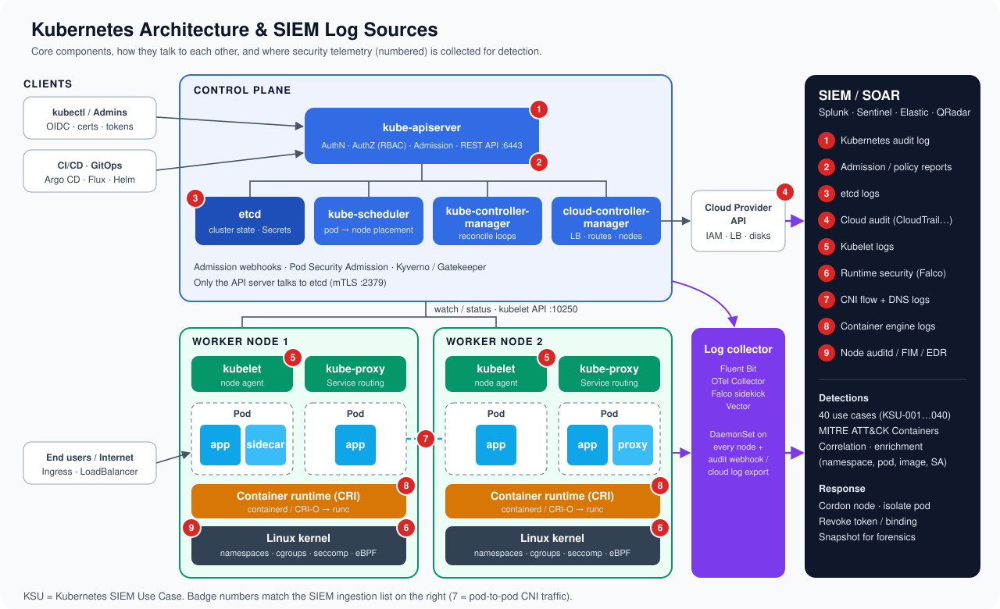
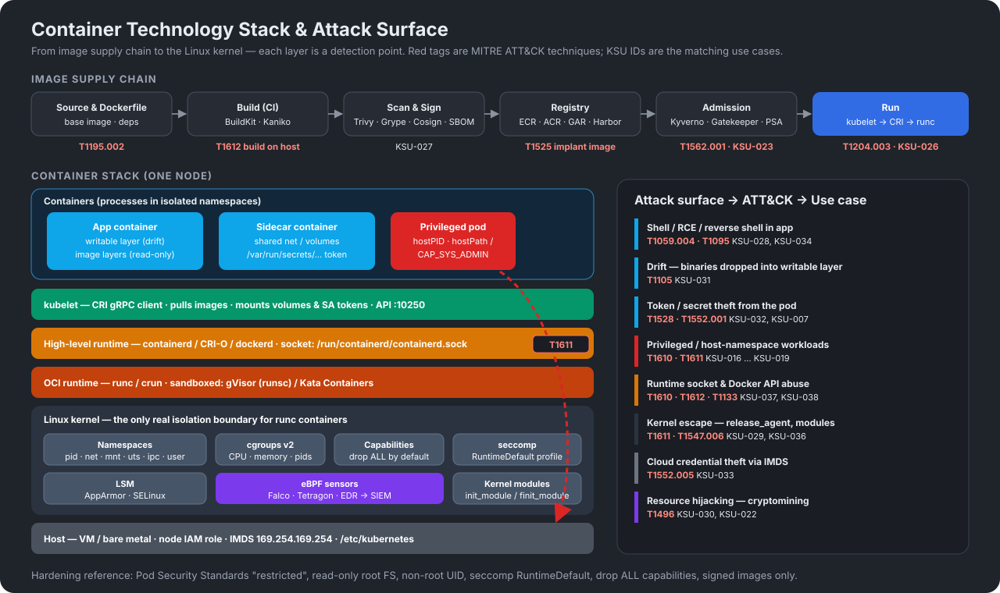

# Kubernetes & Container SIEM Use Cases

40 SIEM detection use cases for **Kubernetes** and **container technology** (Docker, containerd, CRI-O, runc). For each one the library gives:

| Field | Description |
|-------|-------------|
| **Use Case Name** | What the detection finds |
| **Severity** | Critical / High / Medium / Low |
| **Log Source** | Telemetry the detection needs (K8s audit, Falco, kubelet, Docker, cloud audit, CNI flows…) |
| **Sample Logs** | Realistic, sanitized sample event |
| **Confidence Score** | 0–100 expected true-positive likelihood after baseline tuning |
| **MITRE mapping** | ATT&CK tactics and techniques (Containers matrix), linked to attack.mitre.org |

Each use case also includes a description, vendor-neutral detection logic and known false positives.

## Web page

`index.html` is a static, searchable web page with no build step or dependencies. It includes:

- Full-text search across every field, sample log content included (press `/` to focus)
- Filters for severity, category, log source, MITRE tactic and minimum confidence, plus sorting
- Expandable detail view with syntax-highlighted sample logs and copy buttons
- **Kubernetes architecture & component diagram** showing the SIEM log-source tap points
- **Container technology stack & attack surface diagram**
- MITRE ATT&CK coverage grid (select a technique to filter)
- CSV / JSON export of the current filtered view, dark theme and shareable filter URLs

### Publish with GitHub Pages

1. Go to **Settings → Pages** in this repository.
2. Under **Build and deployment**, choose **Source: Deploy from a branch**.
3. Select the branch that holds these files and the **`/ (root)`** folder, then **Save**.
4. The site appears at `https://<owner>.github.io/<repo>/` within a minute or two.

To run it locally, start any static server, for example `python3 -m http.server 8000`, and open http://localhost:8000.

## Repository layout

```
index.html                         Web page
assets/js/usecases.js              Use case data (single source of truth)
assets/js/app.js                   Search / filter / render / export logic
assets/css/style.css               Styles (light + dark)
assets/img/kubernetes-architecture.svg   Kubernetes architecture & log sources
assets/img/container-technology.svg      Container stack & attack surface
data/usecases.csv | usecases.json  Generated exports for SIEM import
tools/build-data.js                Regenerates data/ and the table below
```

After editing `assets/js/usecases.js`, run `node tools/build-data.js` to refresh the CSV, the JSON and the table below.

## Diagrams





## Use case list

<!-- USE-CASES:START -->
| ID | Use Case Name | Severity | Log Source | Confidence | MITRE ATT&CK |
|----|---------------|----------|------------|-----------:|--------------|
| KSU-001 | Anonymous Access to Kubernetes API Server | Critical | Kubernetes Audit Log | 92 | [T1133](https://attack.mitre.org/techniques/T1133/), [T1078.001](https://attack.mitre.org/techniques/T1078/001/) |
| KSU-002 | Ingress Controller Admission Webhook Exploitation (IngressNightmare) | Critical | Falco (Runtime Security)<br>CNI Flow Logs (Cilium Hubble / Calico)<br>Ingress-NGINX Controller Logs | 85 | [T1190](https://attack.mitre.org/techniques/T1190/), [T1059.004](https://attack.mitre.org/techniques/T1059/004/) |
| KSU-003 | Cluster-Admin ClusterRoleBinding Created | Critical | Kubernetes Audit Log | 90 | [T1098.006](https://attack.mitre.org/techniques/T1098/006/), [T1078](https://attack.mitre.org/techniques/T1078/) |
| KSU-004 | Wildcard RBAC Role or ClusterRole Created | High | Kubernetes Audit Log | 80 | [T1098.006](https://attack.mitre.org/techniques/T1098/006/) |
| KSU-005 | User Impersonation via Impersonate Headers | High | Kubernetes Audit Log | 78 | [T1078](https://attack.mitre.org/techniques/T1078/) |
| KSU-006 | Secrets Enumeration Across Namespaces | High | Kubernetes Audit Log | 82 | [T1552.007](https://attack.mitre.org/techniques/T1552/007/), [T1613](https://attack.mitre.org/techniques/T1613/) |
| KSU-007 | Service Account Token Used from Outside the Cluster | High | Kubernetes Audit Log<br>Cloud Audit Logs (CloudTrail / Azure Activity / GCP Audit) | 86 | [T1528](https://attack.mitre.org/techniques/T1528/), [T1550.001](https://attack.mitre.org/techniques/T1550/001/) |
| KSU-008 | CertificateSigningRequest Approved for Privileged Group | Critical | Kubernetes Audit Log | 88 | [T1649](https://attack.mitre.org/techniques/T1649/) |
| KSU-009 | Permission Probing – Burst of Forbidden (403) Responses | Medium | Kubernetes Audit Log | 65 | [T1069](https://attack.mitre.org/techniques/T1069/), [T1613](https://attack.mitre.org/techniques/T1613/) |
| KSU-010 | kubectl exec / attach / debug into Pod | Medium | Kubernetes Audit Log | 60 | [T1609](https://attack.mitre.org/techniques/T1609/) |
| KSU-011 | Exec into kube-system or Control-Plane Pod | High | Kubernetes Audit Log | 85 | [T1609](https://attack.mitre.org/techniques/T1609/), [T1611](https://attack.mitre.org/techniques/T1611/) |
| KSU-012 | Direct etcd Access from Unauthorized Client | Critical | etcd Logs<br>CNI Flow Logs (Cilium Hubble / Calico)<br>Host Firewall / VPC Flow Logs | 87 | [T1552.007](https://attack.mitre.org/techniques/T1552/007/), [T1613](https://attack.mitre.org/techniques/T1613/) |
| KSU-013 | Port-Forward or API Proxy Tunnel to Internal Service | Low | Kubernetes Audit Log | 55 | [T1572](https://attack.mitre.org/techniques/T1572/) |
| KSU-014 | Kubernetes Events Deleted | Medium | Kubernetes Audit Log | 80 | [T1070](https://attack.mitre.org/techniques/T1070/) |
| KSU-015 | Mass Deletion of Workloads or Namespaces | Critical | Kubernetes Audit Log | 84 | [T1485](https://attack.mitre.org/techniques/T1485/), [T1489](https://attack.mitre.org/techniques/T1489/) |
| KSU-016 | Privileged Pod Created | High | Kubernetes Audit Log<br>Admission Controller (Kyverno / OPA Gatekeeper / PSA) | 85 | [T1610](https://attack.mitre.org/techniques/T1610/), [T1611](https://attack.mitre.org/techniques/T1611/) |
| KSU-017 | Sensitive hostPath Volume Mounted | High | Kubernetes Audit Log<br>Admission Controller (Kyverno / OPA Gatekeeper / PSA) | 85 | [T1611](https://attack.mitre.org/techniques/T1611/), [T1552.001](https://attack.mitre.org/techniques/T1552/001/) |
| KSU-018 | Pod Using Host Namespaces (hostPID / hostNetwork / hostIPC) | High | Kubernetes Audit Log<br>Admission Controller (Kyverno / OPA Gatekeeper / PSA) | 78 | [T1611](https://attack.mitre.org/techniques/T1611/), [T1613](https://attack.mitre.org/techniques/T1613/) |
| KSU-019 | Dangerous Linux Capabilities Added to Container | High | Kubernetes Audit Log<br>Admission Controller (Kyverno / OPA Gatekeeper / PSA) | 75 | [T1611](https://attack.mitre.org/techniques/T1611/), [T1068](https://attack.mitre.org/techniques/T1068/) |
| KSU-020 | Workload Deployed to kube-system by Non-System Identity | High | Kubernetes Audit Log | 80 | [T1036.005](https://attack.mitre.org/techniques/T1036/005/), [T1610](https://attack.mitre.org/techniques/T1610/) |
| KSU-021 | Suspicious CronJob Created | High | Kubernetes Audit Log | 74 | [T1053.007](https://attack.mitre.org/techniques/T1053/007/) |
| KSU-022 | DaemonSet Created or Modified (Cluster-Wide Persistence) | High | Kubernetes Audit Log | 70 | [T1543.005](https://attack.mitre.org/techniques/T1543/005/), [T1610](https://attack.mitre.org/techniques/T1610/) |
| KSU-023 | Admission Webhook or Policy Engine Deleted / Weakened | High | Kubernetes Audit Log | 84 | [T1562.001](https://attack.mitre.org/techniques/T1562/001/) |
| KSU-024 | NetworkPolicy Deleted or Default-Deny Removed | Medium | Kubernetes Audit Log | 70 | [T1562.007](https://attack.mitre.org/techniques/T1562/007/) |
| KSU-025 | Control-Plane Audit Logging Disabled (EKS / AKS / GKE) | Critical | Cloud Audit Logs (CloudTrail / Azure Activity / GCP Audit) | 92 | [T1562.008](https://attack.mitre.org/techniques/T1562/008/) |
| KSU-026 | Image from Untrusted or Public Registry Deployed | Medium | Kubernetes Audit Log<br>Kubelet Logs | 70 | [T1204.003](https://attack.mitre.org/techniques/T1204/003/), [T1525](https://attack.mitre.org/techniques/T1525/) |
| KSU-027 | Image Signature or Admission Policy Verification Failure | High | Admission Controller (Kyverno / OPA Gatekeeper / PSA)<br>Kubernetes Audit Log | 85 | [T1195.002](https://attack.mitre.org/techniques/T1195/002/), [T1525](https://attack.mitre.org/techniques/T1525/) |
| KSU-028 | Interactive Shell Spawned in Container | Medium | Falco (Runtime Security)<br>EDR / Linux auditd | 70 | [T1059.004](https://attack.mitre.org/techniques/T1059/004/), [T1609](https://attack.mitre.org/techniques/T1609/) |
| KSU-029 | Container Escape Attempt (nsenter / release_agent / host mount) | Critical | Falco (Runtime Security)<br>EDR / Linux auditd | 90 | [T1611](https://attack.mitre.org/techniques/T1611/) |
| KSU-030 | Cryptomining Activity in Container | High | Falco (Runtime Security)<br>DNS Logs (CoreDNS)<br>CNI Flow Logs (Cilium Hubble / Calico) | 90 | [T1496](https://attack.mitre.org/techniques/T1496/) |
| KSU-031 | Container Drift – New Binary Dropped and Executed | High | Falco (Runtime Security)<br>EDR / Linux auditd | 76 | [T1105](https://attack.mitre.org/techniques/T1105/), [T1059.004](https://attack.mitre.org/techniques/T1059/004/) |
| KSU-032 | Service Account Token or Sensitive File Read by Unexpected Process | High | Falco (Runtime Security)<br>EDR / Linux auditd | 74 | [T1552.001](https://attack.mitre.org/techniques/T1552/001/), [T1528](https://attack.mitre.org/techniques/T1528/) |
| KSU-033 | Cloud Instance Metadata (IMDS) Accessed from Pod | High | Falco (Runtime Security)<br>CNI Flow Logs (Cilium Hubble / Calico) | 80 | [T1552.005](https://attack.mitre.org/techniques/T1552/005/) |
| KSU-034 | Reverse Shell from Container | Critical | Falco (Runtime Security)<br>EDR / Linux auditd<br>CNI Flow Logs (Cilium Hubble / Calico) | 90 | [T1059.004](https://attack.mitre.org/techniques/T1059/004/), [T1095](https://attack.mitre.org/techniques/T1095/) |
| KSU-035 | Network Scanning Tool Executed in Container | Medium | Falco (Runtime Security)<br>CNI Flow Logs (Cilium Hubble / Calico) | 80 | [T1046](https://attack.mitre.org/techniques/T1046/), [T1613](https://attack.mitre.org/techniques/T1613/) |
| KSU-036 | Kernel Module Loaded from Container | Critical | Falco (Runtime Security)<br>EDR / Linux auditd | 88 | [T1547.006](https://attack.mitre.org/techniques/T1547/006/), [T1611](https://attack.mitre.org/techniques/T1611/) |
| KSU-037 | Container Runtime Socket Accessed from Container | Critical | Falco (Runtime Security)<br>Docker Daemon Logs / Events<br>Kubernetes Audit Log | 88 | [T1611](https://attack.mitre.org/techniques/T1611/), [T1610](https://attack.mitre.org/techniques/T1610/) |
| KSU-038 | Exposed Docker Remote API Used to Create or Build Containers | Critical | Docker Daemon Logs / Events<br>Host Firewall / VPC Flow Logs | 90 | [T1133](https://attack.mitre.org/techniques/T1133/), [T1610](https://attack.mitre.org/techniques/T1610/), [T1612](https://attack.mitre.org/techniques/T1612/) |
| KSU-039 | Static Pod Manifest or Kubelet Config Tampered on Node | Critical | EDR / Linux auditd<br>File Integrity Monitoring<br>Kubelet Logs | 86 | [T1543.005](https://attack.mitre.org/techniques/T1543/005/), [T1562.001](https://attack.mitre.org/techniques/T1562/001/) |
| KSU-040 | Unauthenticated or Anomalous Kubelet API Access (10250) | Critical | Kubelet Logs<br>Host Firewall / VPC Flow Logs<br>Kubernetes Audit Log | 85 | [T1609](https://attack.mitre.org/techniques/T1609/), [T1133](https://attack.mitre.org/techniques/T1133/) |
<!-- USE-CASES:END -->

## Notes

- Detection logic is pseudo-SPL. Translate it to Splunk SPL, Sentinel KQL, Elastic EQL/ES|QL, QRadar AQL or Chronicle YARA-L.
- Sample logs are synthetic. They use RFC 5737 documentation IP ranges and fictitious names.
- Minimum telemetry: an API server audit policy at `Metadata` level (`RequestResponse` for RBAC and workload objects) and Falco or an equivalent eBPF runtime sensor on every node.
- MITRE ATT&CK® is a registered trademark of The MITRE Corporation.
